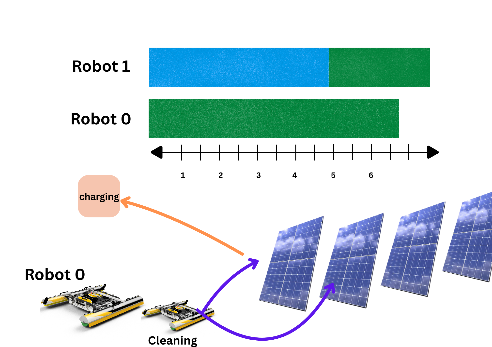
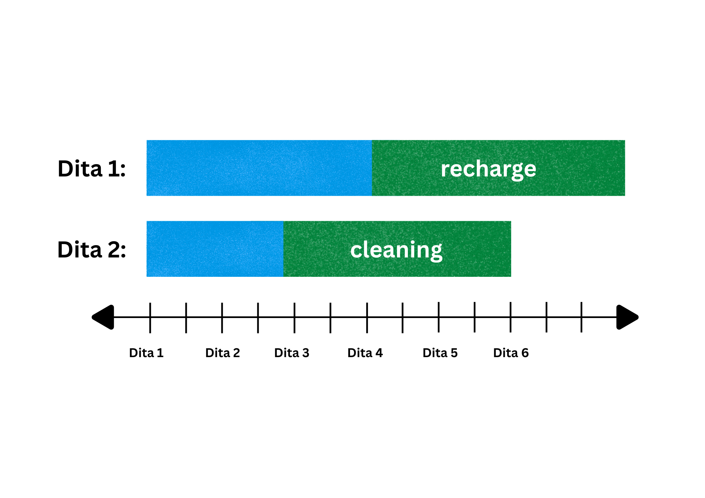

# Solar Panel Cleaning Robot Scheduling with Energy Constraints

## Introductory Information


**University of Prishtina**  
**Faculty of Computer and Software Engineering**  
**Master’s Program**  
Course: **Algorithms inspired by nature**

## Professor

- **Prof. Kadri Sylejmani**

## Project Team Members 

- **Rukije Morina**
- **Diana Zymberi**

---

## Project Overview

The increasing deployment of solar farms worldwide has made maintaining panel efficiency a critical task. Cleaning solar panels regularly prevents efficiency loss due to dust and dirt accumulation. Autonomous cleaning robots are a sustainable solution, but their operation is constrained by battery capacities and energy management.

In this project, you are tasked with scheduling solar panel cleaning robots in such a way that the total weighted cleanliness score of all panels cleaned within the limited working hours is maximized.

---

## Problem Description

### Solar Panels

There are `N` solar panels indexed from 0 to N-1. Each panel has an importance score reflecting how critical it is to keep the panel clean to maintain optimal energy production.

### Robots

There are `M` cleaning robots indexed from 0 to M-1. Each robot:

- Has a battery with limited energy capacity.
- Consumes energy both when traveling between panels and when cleaning.
- Can recharge energy through solar power when idle or while cleaning, but the recharge rate is limited.
- Starts at a predefined initial position (e.g., charging station).

### Time and Energy Constraints

- The robots operate within a fixed total time `T` (e.g., one working day).
- Moving from panel `i` to panel `j` takes a known amount of time.
- Cleaning a panel requires a fixed cleaning time.
- Energy consumption rates for moving and cleaning are known for each robot.
- Robots cannot operate if their battery energy is depleted; they must recharge to continue.
- Robots may recharge while idle or cleaning, but the recharge rate is limited and cannot exceed solar energy availability.
- Robots cannot clean the same panel simultaneously.

### Cleaning Rules

- Each panel can be cleaned multiple times, but the importance score for that panel is counted only once towards the total score.
- Cleaning of a panel must be completed within the total available time `T`.
- Robots may wait or recharge between tasks but must finish all activities within `T`.

---

## Objective

The goal of this project is to schedule routes, cleaning, and charging times for all robots to maximize the total sum of importance scores of all panels cleaned within the working time `T`.

---

## Example Scenario




- Robot 0 requires 2 hours to fully recharge before starting cleaning,
- Robot 1 requires 3 hours to fully recharge,
- Robot 1 starts recharging before Robot 0,
then
- The recharge process of Robot 1 starts on hour 0, and finishes on hour 3
(3 hours total),
- Robot 1 can start cleaning panels beginning at hour 3 (immediately after 
recharge completes),
- The recharge of Robot 0 starts on hour 3 (right after Robot 1 finishes) and 
finishes on hour 5 (2 hours total),
- Robot 0 can start cleaning panels beginning at hour 5.


**Detailed Timeline:**

- **Day 0 to Day 2**: Robot 0 completes its recharge process.
- **Day 3**: Robot 1 starts cleaning panel 0 and panel 4.
- **Day 4**: Robot 1 continues cleaning panel 1.
- **Day 5**: Robot 0 begins cleaning panel 2 and panel 3.
- **Day 6**: Robot 0 completes cleaning panel 5 and panel 6.

---
## Solar Panel Cleaning


The process for solar panel cleaning would look like this:
- All panels are cleaned by the robots in the cleaning facility 
- The entire process of moving robots to panels, cleaning them, and 
returning to charging stations happens over a series of days.
- Each robot can clean a specific number of panels per day, and there’s a 
maximum number of panels that can be cleaned per day by each robot.
- Time constraints: The robots must also manage their energy usage by 
recharging, which can affect the number of panels they can clean each 
day.
Example for Solar Panel Cleaning:
- Robot 0 needs to clean 5 panels.
- Robot 0 can clean 2 panels per day.
- Robot 0 completes its signup/recharge process on day 1.
Then:
- Day 2: Robot 0 can clean 2 panels.
- Day 3: Robot 0 can clean 2 panels again.
- Day 4: The one remaining panel can be cleaned.
Example for Solar Panel Cleaning
- Robot 0 has 5 panels to clean and can clean 2 panels per day.
- Day 1: The robot starts its recharge process 
- Day 2: Robot 0 can clean 2 panels.
- Day 3: Robot 0 can clean 2 more panels.
- Day 4: The remaining 1 panel is cleaned.

## Input Data Format

### File Format

Each input data set is provided in a plain text file with ASCII characters. The file follows the standard UNIX-style line endings (`\n`). When multiple numbers are given in one line, they are separated by a single space.

### Input Format

The first line of the file contains:

- `N`: The number of solar panels (1 ≤ N ≤ 10^5)
- `M`: The number of robots (1 ≤ M ≤ 10^5)
- `T`: The number of total available days (1 ≤ T ≤ 10^5)

This is followed by one line containing `N` integers representing the importance scores for each panel (0 ≤ S_i ≤ 1000).

Following this, there are `M` sections that describe each robot. Each section contains:

1. The first line:
   - `C`: The cleaning capacity of the robot (maximum number of panels cleaned per day)
   - `R`: The recharge time for the robot (time in hours required to recharge after cleaning)
   - `E`: The energy capacity of the robot (maximum energy the robot can carry)
2. The second line:
   - The initial position of the robot (charging station ID) (0 ≤ position ≤ N-1)

After the robots' descriptions, each panel's cleaning time is provided on a separate line.

---


- Robot 0 has a cleaning capacity of 2 panels per day, recharge time of 3 hours, and energy capacity of 10.
- Robot 1 has a cleaning capacity of 2 panels per day, recharge time of 3 hours, and energy capacity of 12.

---

## Scoring

The score is the sum of the scores of all panels that are cleaned within the available time `T`.  
If the same panel is cleaned by multiple robots within the allowed time, the solution is accepted, but the score for that panel is only counted once.

### Capacity and Energy Considerations

- **Cleaning Capacity**: Each robot can clean a limited number of panels per day. If a robot’s capacity is exceeded, it cannot clean additional panels that day.
- **Energy Consumption**: Robots use energy when traveling between panels and cleaning them. If a robot’s energy runs out, it must recharge before resuming cleaning. Recharge time is included in the total available time `T`.
- **Recharge Time**: Robots cannot clean panels while recharging. They must wait until they have enough energy to continue.
- **Cleaning the Same Panel**: If a robot cleans the same panel multiple times, only the first cleaning counts toward the score.

---

### Example Results

When you run `run_all_instances.py`, you will see output similar to:

```
...
This file has run with 10*5 - large data
Running SolarSweep_Alpha_1.json...
Solution score: 7127019
...
Running PanelPatrol_Beta_2.json...
Solution score: 34
...
Running CleanGrid_Gamma_3.json...
Solution score: 78
...
Running SunTrackers_Mu_4.json...
Solution score: 7127019

...
Running RoboShine_Nu_5.json...
Solution score: 122

...

Running HelioClean_Omicron_6.json...
Solution score: 159


Each instance is processed, validated, and its score is displayed. Results are saved in the `output` folder, with each file named according to the input instance.

---

**Note:**  
Scores may vary significantly between instances, especially for larger ones like `SolarSweep_Alpha_1.json`, which can produce much higher scores due to the increased number of panels.


